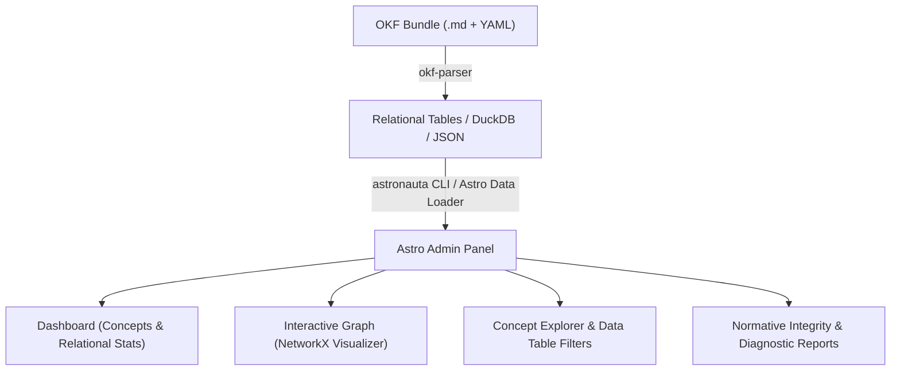

# Astronauta 👩‍🚀

> **Automatic Admin Panel & Web Dashboard for Open Knowledge Format (OKF v0.2) Bundles, powered by `okf-parser` and Astro.js.**

`astronauta` bridges `okf-parser` (relational inspection, DuckDB compilation, and NetworkX graph generation) with a modern, high-performance Astro.js web interface.

---

## 🎯 Architecture



## 🚀 Features

1. **Automatic Bundle Ingestion:** Reads OKF v0.2 bundles (concepts, frontmatter metadatos, links, and markdown bodies) via Python bridge / `okf-parser`.
2. **Relational Dashboard:** High-level metrics, concept breakdown, link cardinality, and validation status (Normative Errors vs. Advisory Diagnostics).
3. **Interactive Knowledge Graph:** Renders NetworkX-projected relations using visual force-directed graph components.
4. **Concept Explorer & Faceted Filter:** Search, filter, and inspect any OKF concept with full YAML frontmatter and rendered Markdown body.
5. **Dark Mode & Modern UI:** Sleek, glassmorphism-inspired UI designed for legal, technical, or administrative knowledge bases.

---

## 🛠️ CLI & Usage

```bash
# Generate Astro Admin Site from an OKF Bundle
python -m astronauta generate /path/to/okf-bundle --out ./dist

# Run Dev Server
bun run dev
```

---

## 📄 License

MIT © Franklin Baldo
