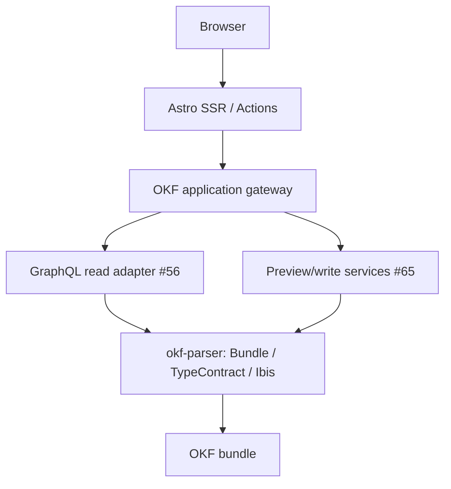

# RFC 0001 — Live OKF Admin

- Status: Proposed
- Discussion: #2
- Date: 2026-08-08
- Preferred upstream read adapter: `franklinbaldo/okf-parser#56`
- Reusable read projections: `franklinbaldo/okf-parser#67`
- Identity/digests: `franklinbaldo/okf-parser#53` / `#62`
- Upstream dependency for editing: `franklinbaldo/okf-parser#65`

## Summary

Astronauta should become a live, Django-admin-style interface for an arbitrary Open Knowledge Format directory.

The project should stop treating `okf-parser` as a build-time extractor that generates JSON snapshots for Astro. Instead, Astronauta should run as an on-demand Astro application over the public capabilities of the Python `okf-parser` core.

The architectural boundary is:

> Astronauta owns presentation and interaction. `okf-parser` owns OKF semantics and filesystem mutation.

A second rule is equally important:

> One semantic authority is mandatory. One transport is not.

Astronauta therefore must not make FastMCP, GraphQL, REST, or any other protocol its semantic architecture. It should depend on an application gateway expressed in domain capabilities.

For reads, the preferred adapter is the GraphQL capability proposed in `okf-parser#56`, because its query model naturally matches an admin interface: concepts, typed fields, filters, ordering, pagination, links, reverse links, diagnostics, and identity.

For writes, Astronauta should use explicit preview/commit services such as `okf-parser#65`. Generic GraphQL mutations are not a prerequisite.

MCP remains useful for agents and automation, but it does not define the browser application's backend.

The target user experience remains intentionally small:

```bash
astronauta path/to/bundle
astronauta path/to/bundle --write
```

Read-only is the default. Write authority must be explicit.

## Context

The current proof of concept successfully established that an OKF bundle can produce a useful admin-like interface: bundle summary, concept explorer, graph, and diagnostics. Its implementation, however, reflects the capabilities available when the experiment began.

Today the flow is approximately:

```text
OKF directory
    |
    v
Astronauta Python CLI
    |
    +--> load_bundle()
    +--> pandas / NetworkX
    +--> summary.json
    +--> concepts.json
    +--> graph.json
    +--> diagnostics.json
             |
             v
         static Astro
```

That design has three costs.

First, generated JSON becomes a second representation whose freshness must be managed. A file change is not visible until generation runs again.

Second, the adapter duplicates semantic decisions that belong to `okf-parser`. The proof of concept, for example, contains fallback type inference from the parent directory even though authored OKF `type` is semantic identity and missing `type` is a parser diagnostic.

Third, `okf-parser` has grown into a substantially richer platform. Its roadmap now includes:

- canonical `Bundle` and normalized concept/link relations;
- `TypeContract` as the shared schema IR;
- RFC 0006 typed relations and `Bundle.compile_types(...)` over Ibis/DuckDB;
- deterministic identity and digests (`#53` / `#62`);
- reusable serializable projections (`#67`);
- an optional read-only GraphQL adapter intended for Astro/application use (`#56`);
- bounded preview/write services, including the missing single-concept edit primitive (`#65`);
- MCP as a serializable adapter for agents and automation.

Astronauta should align with that decomposition rather than elevating one transport adapter into the product architecture.

## Product model

Astronauta is an admin for a directory, not a framework users configure model by model.

The useful Django Admin analogy is:

| Django Admin | Astronauta / OKF |
| --- | --- |
| model | authored `type` |
| object | concept Markdown document |
| fields | frontmatter |
| rich text/content | Markdown body |
| relations | normalized/resolved Markdown links |
| queryset/list view | GraphQL/relational query projection |
| model/schema contract | `TypeContract` / declared schema |
| model validation | OKF/schema diagnostics |
| admin action | bounded parser services such as apply/format/edit preview/commit |

This analogy is intentionally limited. Astronauta should not introduce an ORM, migrations, model registration, or a second persistence layer.

A directory should become useful immediately when it contains OKF concepts:

```text
knowledge/
  tarefas/
    comprar-cafe.md
    revisar-processo.md
  pessoas/
    franklin.md
```

```yaml
---
type: Tarefa
status: aberta
responsavel: Franklin
---
```

No `admin.py` or `astronauta.yml` should be required for the basic admin surface.

## Decision

### 1. Replace static generation with a live server boundary

Astronauta will move to Astro on-demand/SSR mode. Server-side Astro code will obtain canonical bundle state at request/action time through an OKF application gateway.

Generated `src/data/*.json` files will cease to be sources of truth. They may exist temporarily during migration but are not part of the target architecture.

A reload after an authored file change should reflect the current bundle without a separate generation command.

### 2. Keep one semantic authority: the Python `okf-parser` core

The canonical semantic implementation is the Python `okf-parser` core and its public APIs:

- `Bundle` and canonical concept/link relations;
- `TypeContract` and schema compilation;
- Ibis/DuckDB typed execution;
- diagnostics and path classification;
- source/revision identity;
- preview/write services.

Astronauta must not reconstruct these semantics in Astro, nor split live authority between independent Python and TypeScript parsers.

The TypeScript package remains valuable for ecosystem use and conformance, but using it as the canonical Astronauta reader while Python owns writes would create two live semantic authorities and make release skew/capability differences an application concern.

### 3. Introduce an OKF application gateway

Astro pages and Actions should depend on a server-only gateway expressed in application capabilities, for example:

```text
listTypes()
listConcepts(type, filter, order, page)
getConcept(id)
getSchema(type)
getLinks(id)
getDiagnostics(...)
previewEdit(...)
commitEdit(...)
```

These names are illustrative, not an API specification.

The critical property is that presentation code depends on concepts such as "get concept" and "preview edit", not on MCP tool names, GraphQL transport details, or raw Ibis handles.

The gateway is an adapter boundary, not a second domain model. It must preserve upstream identity, type/schema semantics, diagnostics, and errors rather than normalize them into Astronauta-specific truth.

### 4. Prefer GraphQL for reads

`okf-parser#56` is the preferred read adapter for Astronauta.

Its proposed shape matches the product directly:

- `concept(id)` and `concepts(...)`;
- generated object types from `TypeContract`;
- deterministic pagination;
- bounded filters and ordering;
- typed fields;
- forward and reverse links;
- diagnostics and reserved records;
- source/revision digests.

The intended composition is:



GraphQL is preferred, not mandatory at the presentation boundary. The gateway may use canonical serializable projections from `okf-parser#67` for narrow operations where they are simpler, and #56 itself may query canonical relations directly where pushdown/execution makes that better than a JSON round-trip.

### 5. Do not make transport a normative decision

This RFC deliberately does not prescribe how the gateway crosses the Python/Node boundary.

Possible implementations include:

- an embedded/in-process adapter where packaging allows it;
- GraphQL over loopback HTTP;
- narrow loopback command endpoints for writes;
- another local RPC transport hidden behind the gateway.

The choice may evolve with packaging constraints without changing Astro pages or the semantic contract.

FastMCP therefore is **not** the canonical backend of Astronauta.

MCP may expose the same underlying read projections and write services for agents, tests, and automation. It remains a peer adapter, not the protocol of the UI.

### 6. Read-only is the default capability profile

`astronauta PATH` launches a gateway profile with read/query capabilities and no commit authority.

`astronauta PATH --write` explicitly enables commit-capable services.

UI controls are not the authorization boundary. In read-only mode, commit operations must be unavailable at the gateway/service capability boundary as well.

Public/multi-user hosting is outside this RFC.

### 7. `type` is the admin model boundary

Admin navigation and list views are grouped by the authored OKF `type` returned by the parser.

Folder names may be shown as context but must not infer or repair semantic type.

Adding a concept of an existing type should make it appear automatically. Adding a new type should create a new admin type surface automatically. Neither requires Astronauta registration code.

### 8. `TypeContract` drives fields; absence of schema remains explicit

Astronauta will consume canonical schema contracts owned by `okf-parser`, including declared `.schema.sql` information when present.

GraphQL generated types may carry those fields to the application, but GraphQL does not become a second schema IR: field semantics must trace back to `TypeContract` and canonical declared/typed relations.

Schema information may drive:

- display formatting;
- field type labels;
- filtering/sorting affordances;
- form widgets for strings, numbers/decimals, booleans, dates/datetimes, enums, and other supported scalars.

A type without a declaration remains fully inspectable. Astronauta must not silently turn observed lexemes into a normative physical schema.

Unknown or unsupported frontmatter must remain visible through a generic representation rather than being discarded.

### 9. Editing is preview-first and service-owned

Astronauta must never become a general filesystem writer for OKF concept files.

Existing parser write families remain canonical for the operations they already own, including relational frontmatter changes, import/create, formatting, and scaffolding.

A web concept editor additionally needs a bounded single-concept operation, especially for Markdown body changes. That upstream service capability is tracked in `okf-parser#65`.

The expected interaction is:

```text
open concept through read adapter
   |
   +--> canonical path/id
   +--> exact source identity
   v
edit form / Markdown
   |
   v
preview command (#65)
   |
   +--> candidate changes
   +--> diagnostics
   +--> conflict result
   v
explicit commit command (#65)
   |
   v
reload canonical concept through read adapter
```

The first implementation may expose preview/commit to Astro through Actions or narrow local command endpoints. Generic GraphQL mutations are not required.

A future GraphQL mutation adapter may wrap the same services, but it must not introduce a parallel write model.

A failed validation or conflict leaves the real bundle unchanged.

### 10. Use exact source identity for optimistic concurrency

When deterministic digest support is available, the edit page should carry the concept's exact source digest as an expected version.

Commit must fail closed when the current file no longer has that identity. This prevents a browser tab opened against version A from silently overwriting version B.

Parsed/revision identity can separately help distinguish semantic changes from physical rewrites, but exact source identity is the appropriate optimistic-lock token for writes.

Astronauta should render a conflict state and reload/compare options rather than automatically retrying against newer content.

## Initial admin surface

The first live read-only product should include:

1. bundle dashboard with concept/link/diagnostic counts and conformance state;
2. type index;
3. per-type change-list-style view with deterministic pagination;
4. concept detail with identity, path, frontmatter, Markdown body, incoming/outgoing links, and local diagnostics;
5. graph view;
6. diagnostics/classification view.

Search/filter/sort should use bounded capabilities supplied by the canonical read adapter. Astronauta should not invent a query language merely to imitate every Django Admin feature.

## Runtime and packaging

The long-term CLI should own local runtime lifecycle:

```bash
astronauta path/to/bundle
astronauta path/to/bundle --write
```

Conceptually it performs:

1. resolve and validate the target path;
2. initialize the Python OKF application gateway over `okf-parser`;
3. make the preferred GraphQL read adapter available to that gateway;
4. expose preview services and, only with `--write`, commit services;
5. start the Astro application against the gateway;
6. surface the local admin URL;
7. terminate owned processes/resources on exit/signals.

The gateway may be in-process or loopback depending on packaging constraints. Users should not have to coordinate ports, generated snapshots, GraphQL servers, or MCP servers manually.

The exact packaging mechanism can evolve independently as long as the installed artifact verifies the same application contract in CI.

## Failure model

Astronauta should expose upstream failures rather than normalize them into generic success-shaped UI.

Important states include:

- bundle contains normative errors;
- concept cannot be parsed;
- broken link is advisory rather than normative;
- schema declaration is absent;
- schema declaration is invalid;
- typed field cannot be cast;
- preview produces new validation errors;
- exact source identity is stale;
- filesystem changed during a write;
- commit capability is disabled;
- read adapter/gateway cannot initialize.

These states should remain distinguishable in the UI.

## Security boundary

This RFC intentionally targets a local admin.

The minimum boundary is:

- browser never receives raw filesystem authority or parser process capabilities;
- server-side Astro talks only to the application gateway;
- read-only invocation has no commit service;
- `--write` is explicit;
- no arbitrary path write API is exposed;
- no assumption that MCP annotations, GraphQL schema shape, or hidden UI controls are authorization.

If a process boundary is used, its transport should bind locally by default.

Authentication, remote hosting, multi-user authorization, CSRF policy for public deployment, and repository-level ACLs require a separate design before Astronauta is advertised as a network service.

## Alternatives considered

### Keep the current static generator

Rejected as the main architecture. It is simple for publishing a read-only snapshot, but freshness becomes an external build concern and web editing immediately requires a second runtime anyway.

A future `astronauta export` command could still produce a static snapshot as a separate capability if there is demand.

### Make FastMCP HTTP the canonical backend

Rejected.

FastMCP already exposes useful serialized capabilities and remains valuable for agents and automation, but its tool-oriented surface is not the best application query model for a Django-admin-style UI. Making it canonical would couple presentation architecture to an adapter that exists for a broader purpose.

The upstream roadmap already has a more natural read path in #56 and a lower-level transport-neutral projection layer in #67.

### Use GraphQL for both reads and generic writes

Rejected for the initial architecture.

GraphQL is a strong fit for read queries, but write safety already has explicit preview/commit semantics and filesystem conflict invariants. The first editor should call those bounded services rather than introduce generic mutations merely for protocol symmetry.

A future mutation adapter can wrap the same services if useful.

### Import the TypeScript `okf-parser` package directly in Astro

Rejected as the canonical backend while Python remains the complete semantic/write authority.

It would make some reads pleasantly small, but splitting live semantics by language/runtime increases version-skew and capability-parity risk. The gateway keeps the presentation independent while the Python core remains authoritative.

### Build a REST API specifically for Astronauta

Rejected as a public product contract. Narrow internal endpoints may be a perfectly valid implementation of the local gateway, especially for commands, but Astronauta should not create a second public semantic API when the upstream core and adapters already define the capabilities.

### Add `admin.py`/per-type registration

Rejected as a prerequisite. It undermines the core product promise that the bundle already contains enough structure to produce a useful generic admin. Optional presentation customization can be considered later only after the zero-config path is strong.

## Migration plan

Implementation is deliberately incremental.

### Phase 0 — UI/build foundation

Merge or supersede the existing Tailwind/CI repair in PR #1 so the current UI has a verified production build before changing the runtime.

### Phase 1 — application gateway and live runtime (#3)

Move Astro to SSR/on-demand mode, introduce the server-only capability gateway, and remove generated JSON as the runtime source of truth.

Do not block the entire migration on a particular transport implementation. The first gateway can adapt the best available canonical upstream read surfaces while preserving the capability boundary.

### Phase 2 — GraphQL read adapter (`okf-parser#56`) and generic admin (#4)

Prefer the GraphQL adapter as it lands, then build authored-`type` navigation, dashboard, lists, detail, graph, and diagnostics over gateway capabilities.

`okf-parser#67` may land independently as reusable lower-level serialization infrastructure.

### Phase 3 — schema-driven fields (#5)

Consume `TypeContract`-derived schema metadata and typed declarations for field display/form rendering without inventing a second type system.

### Phase 4 — safe editing (#6 + `okf-parser#65`)

Add preview-first editing with exact-source optimistic locking and parser-owned commit services. Do not require generic GraphQL mutations.

### Phase 5 — one-command product (#7)

Package gateway lifecycle, read adapter, Astro, and capability selection behind `astronauta PATH [--write]` and verify the installed consumer experience in CI.

## Success criteria

This architecture is successful when:

- almost any OKF directory becomes a useful admin without generated data or per-type registration;
- the UI reflects authored changes on reload;
- Astronauta contains no independent OKF parser or concept-file writer;
- Python `okf-parser` remains the single source of truth for semantics, schema, diagnostics, identity, relations, and mutation;
- GraphQL provides the preferred application read model without becoming a second semantic authority;
- MCP can expose the same capabilities for agents without dictating the UI architecture;
- read-only and write-capable modes differ at the service capability boundary;
- schema declarations improve the admin without becoming mandatory;
- stale web edits cannot silently overwrite newer authored content;
- the common invocation is one command;
- changing transport behind the gateway does not require rewriting presentation code.

## Open questions deliberately deferred

- exact Python/Node gateway transport and packaging mechanism;
- optional project-specific presentation customization;
- remote deployment/authentication;
- Git commit/push workflows after a successful local write;
- static export as a separate feature;
- richer Markdown editing components;
- pagination/query pushdown details for very large bundles;
- whether a future complete TypeScript implementation can itself become the single semantic authority.

None of these is required to prove the core live-admin architecture.